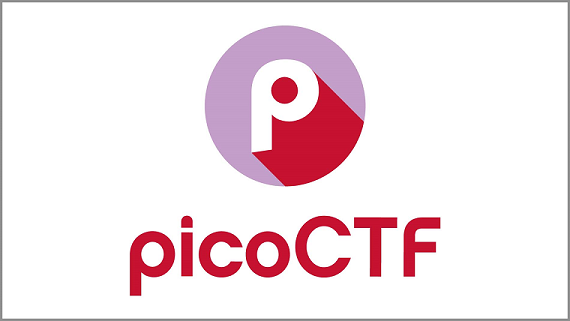

# PicoCTF_Challenges_Write_Up

Welcome to my [picoCTF](https://picoctf.org/) Journey.
This Repo is created to:

* Document for my Journey as a Hacker
* Provide a personal view on solving the challenges
* Be a concrete project to improve my skills in Reverse Engineering, Cryptography, github, etc.

It is organised by categories instead of year, since I like to treat them as a subject and focus on the subject 1 by 1 instead of the year they came out.

## Categories
- [Web Exploitation](Web_Exploitation/Web_Exploitation_ReadMe.md)
- [Cryptography](Cryptography/Crypto_ReadMe.md)
- [Reverse Engineering](Reverse_Engineering/RE_ReadMe.md)
- [Forensics](Forensics/Forensics_ReadMe.md)
- [General Skills](General_Skills/General_Skills_ReadMe.md)
- [Binary Exploitation](Binary_Exploitation/BE_ReadMe.md)

## Spoilers Alert
The solutions contains step-by-step walkthroughs and might show the flags in plain text.  
Since if you really want to cheat, the answer is always online, therefore it's up to you to understand the walkthroughs or you can just cover and paste the flag.

## Language disclaimer
I'm not a native English speaker so please forgive any spelling mistakes or grammatical errors.

## Acknowledgements
 Some of the solutions were inspired by writeups and walkthroughs from these guys:
 - [Almond Force](https://www.youtube.com/@AlmondForce)
 - [David](https://github.com/Dvd848/CTFs)
 - [Gynvael](https://www.youtube.com/@GynvaelEN)
 - [Hayden Housen](https://github.com/HHousen)
 - [John Hammond](https://www.youtube.com/@_JohnHammond)
 - [Martin Carlisle](https://www.youtube.com/@carlislemc)

## Language disclaimer
English isn't my mother tongue so please forgive any spelling mistakes or grammatical errors.
